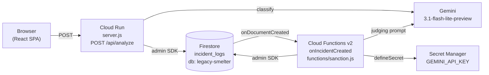
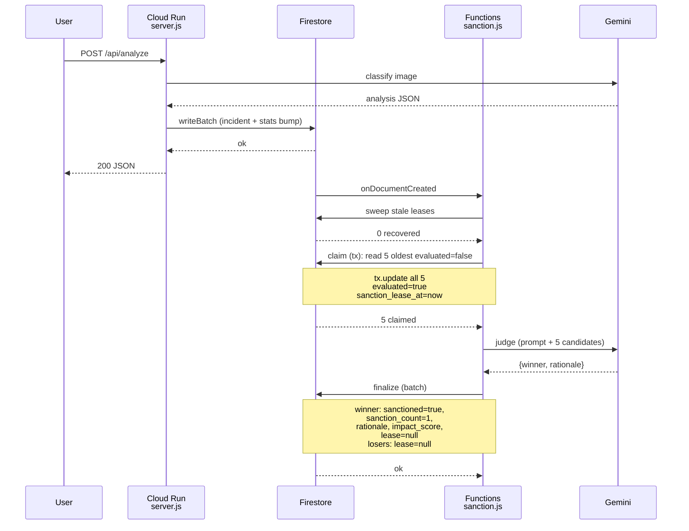
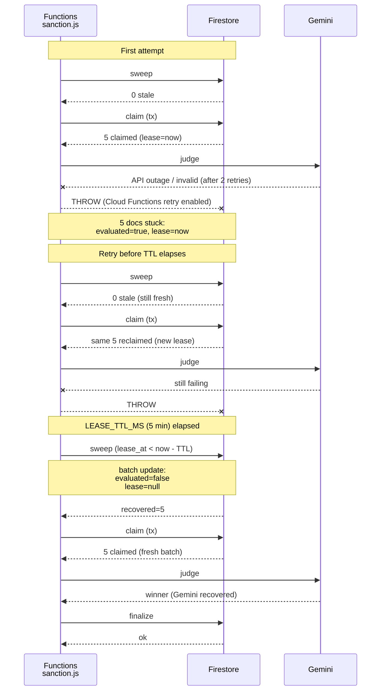

# Sanction judging — system design

**Status:** Permanent. Reflects the architecture introduced by the sanction rebuild branch (2026-04-11).

This document describes the sanction judging pipeline as it runs in production: one Cloud Run service for user-facing `/api/analyze` writes, and one Cloud Functions v2 Firestore trigger that judges incidents in batches of five. Everything in this document is load-bearing; if you are considering changing any invariant here, read the "Trade-offs" section first.

## 1. Components



| Component | Responsibility |
|---|---|
| Cloud Run (`server.js`) | User-facing API. `/api/analyze` verifies a Firebase ID token, derives pixel count, calls Gemini for classification, and writes the incident doc + `global_stats` bump in one `WriteBatch`. Persists `evaluated: false, sanction_lease_at: null` on every new doc so it is immediately eligible for the judging pipeline. |
| Firestore (`legacy-smelter` DB) | `incident_logs` collection holds every classified image. Two new fields back the judging claim: `evaluated: boolean` and `sanction_lease_at: Timestamp \| null`. |
| Eventarc + Cloud Functions v2 | `onDocumentCreated` trigger on `incident_logs/{incidentId}` fires for every new doc. Region: `us-east1` (pinned to the Cloud Run region for latency). `maxInstances: 10`. |
| `functions/sanction.js` | Orchestration module. Exports `runSanctionBatch` which sequences sweep → claim → judge → finalize. Kept independent of the `firebase-functions` runtime so the unit tests can import it directly. |
| Gemini 3.1 Flash Lite Preview | Same model `/api/analyze` uses for classification. The sanction path pins the same model ID so model-lifecycle events (deprecation, quota split) hit both callers together. Structured output via `responseMimeType: 'application/json'` + `responseSchema`. |
| Secret Manager | `GEMINI_API_KEY` is declared via `firebase-functions/params` `defineSecret('GEMINI_API_KEY')` in `functions/index.js`. The deploy manifest wires the GSM binding; the trigger reads `.value()` at invocation time. |

## 2. Sequence — happy path



Key observation: the user's `/api/analyze` response returns after the Cloud Run write commits. The trigger fires asynchronously via Eventarc and has its own failure budget. The user never waits for sanction judging — if the trigger is stuck, the user experience is unaffected.

## 3. Sequence — failure path and recovery



Invariants this recovery flow depends on:

1. **Cloud Functions v2 retry is enabled** — `retry: true` is set in the `onDocumentCreated` options. Without this, a thrown error drops the event and the stranded claim is never revisited.
2. **The sweep runs before every claim** — if the orchestrator reordered to claim-first-sweep-later, a retry that fired before the TTL elapsed would simply re-claim the same stranded docs forever.
3. **Sweep is idempotent** — `sweepStaleLeases` writes the same (`evaluated: false, sanction_lease_at: null`) values regardless of who else ran it. Parallel sweeps are safe.
4. **Lease TTL (5 minutes) is longer than one function execution** — if TTL were shorter than a happy-path invocation, a healthy in-progress run could have its own claim swept out from under it.

## 4. Concurrency analysis

### Claim transaction: atomicity proof

The claim is a Firestore transaction whose read is a single bounded query and whose write updates exactly the read results:

```
tx.get(
  incident_logs
    .where('evaluated', '==', false)
    .orderBy('timestamp', 'asc')
    .limit(5)
)
→ for each doc in the result:
    tx.update(doc.ref, { evaluated: true, sanction_lease_at: <now> })
```

Firestore's transactional guarantee: if any document read by `tx.get` is written by another transaction before this transaction commits, Firestore aborts this transaction and re-runs the callback. On re-run, `tx.get` re-executes the query from scratch.

### Case: 3 concurrent invocations, 15 unevaluated docs

Expected outcome: exactly 3 disjoint batches, 15 docs judged, no overlap.

1. All three transactions start concurrently. Each reads 5 docs.
2. Without loss of generality, say all three read the same 5 (`inc-1..inc-5`).
3. One transaction wins the race to commit. Its 5 writes succeed; those 5 docs now have `evaluated=true`.
4. The other two transactions see the write contention on `inc-1..inc-5` and are aborted by Firestore. Each callback re-runs.
5. On re-run, `tx.get` re-queries. `inc-1..inc-5` are now `evaluated=true` and no longer match the query. Each aborted transaction reads a fresh 5 (`inc-6..inc-10` for one, `inc-11..inc-15` for the other).
6. Both commit. All 15 docs are judged.

The only way two concurrent claims can end up with overlapping sets is if Firestore's transactional semantics themselves fail — which would break every transactional app on the platform, not just this one.

### Case: 3 concurrent invocations, 12 unevaluated docs

Expected outcome: two winners judge 5 docs each; one invocation returns no-op because fewer than 5 unclaimed docs remain.

1. Same race. First commit wins 5.
2. Second re-runs. Query returns docs 6..10. Commit wins.
3. Third re-runs. Query returns docs 11..12 — fewer than `MIN_BATCH`. `claimBatch` returns empty. `runSanctionBatch` returns `{ status: 'no-op' }`. Gemini is never called.

The remaining 2 unclaimed docs sit in the pool until the next `onDocumentCreated` fires (which happens whenever any user creates an incident).

### Case: a single invocation handling a burst of 100 creates

Expected outcome: each trigger fires once, sweeps, tries to claim, and either judges 5 or returns no-op. Across all 100 invocations, ~20 winners are produced.

The trigger is inherently fan-out: Cloud Functions v2 creates one invocation per eligible event. `maxInstances: 10` caps parallel executions; additional events queue in Eventarc. This bounds concurrent Gemini spend in a burst.

## 5. Data model

### `incident_logs` — fields relevant to sanction

| Field | Type | Writer | Purpose |
|---|---|---|---|
| `timestamp` | Timestamp | Cloud Run (`persistIncident`) | Claim query `orderBy` — oldest docs are judged first. |
| `breach_count` | number | Clients via rules | Weighted in `impact_score`. Non-negative finite integer. |
| `escalation_count` | number | Clients via rules | Weighted in `impact_score`. Non-negative finite integer. |
| `sanction_count` | number | Cloud Run (0) + sanction finalize (1) | Weighted in `impact_score`. Always 0 or 1 in practice. |
| `impact_score` | number | Cloud Run (0) + any counter write | `5×sanction + 3×escalation + 2×breach`. Rules enforce the equation per-write. |
| `sanctioned` | boolean | Cloud Run (false) + sanction finalize (true) | Flip-once. Used by the feed UI to render sanction badges. |
| `sanction_rationale` | string \| null | Cloud Run (null) + sanction finalize (≤500 chars) | One-sentence institutional-voice justification from the judge. |
| **`evaluated`** | boolean | Cloud Run (false) + sanction claim (true) | **New.** Claim flag. Claim query filter: `where('evaluated','==',false)`. |
| **`sanction_lease_at`** | Timestamp \| null | Cloud Run (null) + sanction claim (<now>) + finalize/sweep (null) | **New.** Active-claim lease. Sweep recovers any doc whose lease is older than `LEASE_TTL_MS`. |

### Rules contract

Unchanged. `firestore.rules` already rejects client writes that touch `sanction_count`, `sanctioned`, `sanction_rationale`, `impact_score`, `evaluated`, or `sanction_lease_at` because none of these appear in any `hasOnly()` allowlist. The sanction path goes through the Admin SDK which bypasses rules entirely.

### Index set (`firestore.indexes.json`)

| Index | Consumer |
|---|---|
| `(sanctioned ASC, timestamp ASC)` | Feed UI — unsanctioned incidents view. Pre-existing. |
| `(impact_score DESC, timestamp DESC)` | Feed UI — top-impact view. Pre-existing. |
| `(breach_count DESC, timestamp DESC)` | Feed UI — top-breach view. Pre-existing. |
| `(escalation_count DESC, timestamp DESC)` | Feed UI — top-escalation view. Pre-existing. |
| **`(evaluated ASC, timestamp ASC)`** | **New.** `claimBatch` query. |

## 6. Trade-offs

### Why Firestore trigger over Cloud Tasks / polling cron

- **Trigger:** zero latency between incident creation and judging attempt. No polling window. Retry is built into Cloud Functions v2. Scales with write rate automatically.
- **Cloud Tasks:** extra infrastructure to provision. Needs a schedule or a dispatcher. No coupling to the "new incident arrived" event — would reintroduce polling semantics.
- **Polling cron:** the dying pattern we came from. Requires a global run-lock doc to prevent double-runs, has fixed poll intervals that bound worst-case latency, and an operator has to remember to schedule it.

### Why lease-based recovery over burn-on-retry

- **Lease:** a crashed invocation leaves recoverable state. The next sweep reclaims it. Observability is trivial — `where('sanction_lease_at', '<', cutoff)` tells you exactly what is stuck.
- **Burn-on-retry:** claim marks docs permanently-out even if judging fails. Simpler on the happy path, catastrophic if Gemini has an outage — every claim during the outage window becomes unrecoverable.

### Why inline prompt over `readFileSync`

- **Inline:** a deploy necessarily captures the prompt version; a prompt edit is a commit the review pipeline sees; `firebase deploy` cannot ship a partial state where code and prompt diverge.
- **`readFileSync`:** introduces a runtime file dependency that must be bundled correctly by the deploy tool. Prompt drift is possible if the file gets renamed or moved. Diff review of prompt changes becomes indirect.

### Why keep `impact_score` as a stored field

Firestore has no expression/computed indexes. To sort incidents by the derived `impact_score` server-side (which the feed does via `orderBy('impact_score','desc')`), the value must physically exist on the doc so Firestore can build a composite index over it. Moving to client-side computation would mean switching the feed to `orderBy('timestamp')` + bounded-window client sort, which works for small N and scales poorly. See `MEMORY.md` entry "Deferred: impact_score stored field" for the full cleanup path. **Not in scope for the sanction rebuild.**

### Why keep `sanction_count` as a field

Purely for formula symmetry with `breach_count` and `escalation_count`. `sanction_count` is structurally `sanctioned ? 1 : 0` — once a doc is sanctioned it never increments again. Killing the field is cosmetic; blast radius touches `shared/impactScore.js`, `firestore.rules` inline formula duplicate, `src/types.ts`, and every existing doc (backfill). See `MEMORY.md` entry "Deferred: sanction_count as counter". **Not in scope for the sanction rebuild.**
